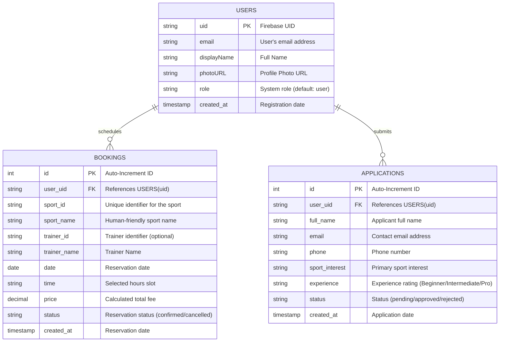

# APEX ARENA – Integrated Sports Club & Facility Management System

**APEX ARENA** is a premium, full-stack, responsive digital platform designed to streamline and modernize operations for sports centers, country clubs, and athletics training hubs. It integrates facility court booking, elite trainer scheduling, and membership applications into a single, cohesive, high-performance web experience.

Check it out https://apex-arena-pi.vercel.app/#
---

## 🚀 Key Features

- **Interactive Court Booking**: Live scheduling of courts and training rooms (Tennis, Padel, Basketball, Squash, Yoga, and Fitness) with real-time slot selection and pricing.
- **Elite Trainer Scheduling**: Profile directory of expert sports coaches with the ability to book direct, private, custom training sessions.
- **My Schedule Dashboard**: Personalized hub where members can monitor upcoming bookings, review past session history, and cancel reservations.
- **Digital Membership Applications**: Structured membership application pipeline where prospective athletes can submit interest, experience levels, and contact details.
- **Secure Authentication**: Authentication powered by Firebase Google Sign-In, ensuring safe and easy account creation.
- **Resilient Dual-Database Architecture**: Production-ready MySQL adapter with a fully self-contained local SQLite file fallback for seamless preview, sandbox, and local testing.

---

## 🛠️ Built With

### Frontend (Client-Side)
- **React.js**: Functional components and modern Hooks setup.
- **Tailwind CSS**: High-contrast modern typographic layout with responsive adaptive grids.
- **Motion (Framer Motion)**: Staggered entry transitions, modal overlays, and visual micro-animations.
- **Lucide Icons**: Crisp vector typography and system indicator icons.

### Backend (Server-Side)
- **Node.js & Express**: Secure backend router managing API requests, validations, and database controllers.
- **Firebase Authentication**: Server-side session guards and background user profile sync.
- **MySQL (`mysql2`)**: Production-grade connection pooling with high concurrency throughput.
- **SQLite (`sqlite` & `sqlite3`)**: Robust native filesystem database serving as local fallback and quick sandbox workspace.

---

## 🗄️ Database Architecture

The system features an automated, environment-aware database switcher. At startup, the server reads configuration flags:
1. If a cloud-based `DB_HOST` is supplied, the server initializes high-speed connection pools to a **MySQL** cluster.
2. Otherwise, it gracefully mounts a **SQLite** database (`database.sqlite`) locally and auto-migrates all tables.

### Entity-Relationship Diagram (ERD)



---

## ⚙️ Environment Variables Setup

Create a `.env` file in the root directory based on the `.env.example` template:

```env
# Gemini AI Configuration
GEMINI_API_KEY="your_gemini_api_key"

# Application Endpoint
APP_URL="http://localhost:3000"

# MySQL Settings (Optional: Omitting forces fallback to local SQLite)
DB_HOST="your_mysql_host"
DB_USER="your_mysql_user"
DB_PASSWORD="your_mysql_password"
DB_NAME="apex_arena"
DB_PORT=3306
```

---

## 🏃 Getting Started

### Prerequisites
- [Node.js](https://nodejs.org/) (v18 or higher recommended)
- [npm](https://www.npmjs.com/)

### Installation

1. Clone the repository:
   ```bash
   git clone https://github.com/yourusername/apex-arena.git
   cd apex-arena
   ```

2. Install dependencies:
   ```bash
   npm install
   ```

3. Run the development server:
   ```bash
   npm run dev
   ```
   The development server will mount Vite middleware inside Express and serve the app at `http://localhost:3000`.

### Building for Production

To create an optimized, production-ready full-stack bundle:
```bash
npm run build
npm start
```

---

## 🌐 Deploying to Vercel

This project is fully configured for zero-downtime, continuous deployment to **Vercel** as a full-stack application. The frontend React single-page application is hosted on Vercel's Edge CDN, and the Express backend API automatically compiles into Vercel Serverless Functions.

### 1. Preparation
Vercel's serverless environment is ephemeral and read-only. We have built-in support that automatically shifts the fallback **SQLite database** file path to Vercel's secure writable `/tmp` space (`/tmp/database.sqlite`) if no external database is connected. 

However, for permanent, durable cloud storage, it is highly recommended to connect a dedicated cloud database (such as **Aiven MySQL, Neon, Supabase, or TiDB Cloud**).

### 2. Steps to Deploy
1. **Push your code** to a GitHub, GitLab, or Bitbucket repository.
2. Sign in to your [Vercel Dashboard](https://vercel.com/) and click **"Add New" ➔ "Project"**.
3. Import your project's repository.
4. Keep the default build settings (Vercel automatically detects Vite as the framework and sets the output directory to `dist`).
5. Expand the **Environment Variables** section and configure:
   - `GEMINI_API_KEY` (Your Google AI Gemini Developer Key)
   - `DB_HOST`, `DB_USER`, `DB_PASSWORD`, `DB_NAME`, `DB_PORT` (Your cloud database credentials if not using Vercel's `/tmp` transient SQLite fallback).
6. Click **"Deploy"**. Vercel will build your static assets and set up the serverless routing flawlessly.

---

## 📂 Project Directory Structure

```text
├── server.ts              # Express.js Server entrypoint & Vite middleware orchestrator
├── schema.sql             # SQL Schema definition for standard MySQL initialization
├── database.sqlite        # Auto-generated local fallback SQLite Database
├── vite.config.ts         # Bundler configuration containing aliases & HMR setup
├── src/
│   ├── main.tsx           # Client entrypoint
│   ├── App.tsx            # App container, Global Auth Provider, and Route handlers
│   ├── api.ts             # Abstracted frontend API service with absolute URL routing
│   ├── db.ts              # Dual SQL engine manager (MySQL Pooling / SQLite Auto-Migrator)
│   ├── firebase.ts        # Client-side Firebase SDK configuration
│   ├── index.css          # Tailwind CSS global entrypoint
│   ├── components/        # Extracted UI blocks
│   │   ├── Navbar.tsx     # High-contrast navigation header
│   │   ├── Hero.tsx       # Punchy sport-aesthetic introductory landing
│   │   ├── BookingSystem.tsx # Full interactive core booking card wizard
│   │   ├── MyBookings.tsx # Live scheduling management logs
│   │   ├── MembersGrid.tsx # Elite Trainer profiles showcase
│   │   ├── Benefits.tsx   # Facility perk display list
│   │   ├── CTA.tsx        # Dynamic Membership Application modal triggers
│   │   └── Footer.tsx     # Footer credentials and structural site links
│   └── constants/         # Static configuration models
│       └── trainers.ts    # Centralized trainer schema and profiles list
```

---

## 🛡️ License

This project is submitted as part of university academic curriculum work. Distributed under the MIT License. See `LICENSE` for more information.
